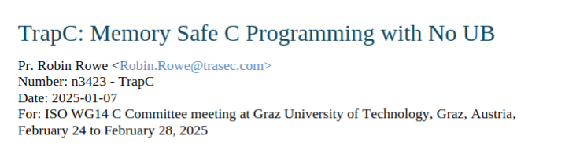
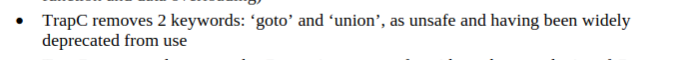
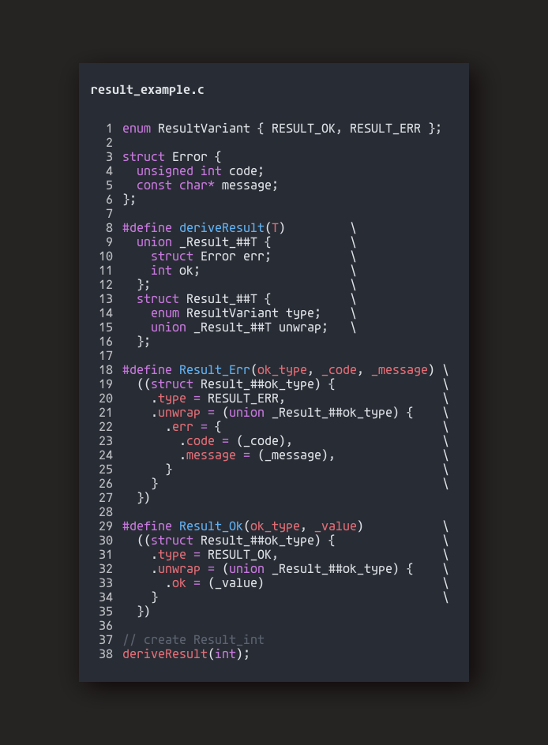
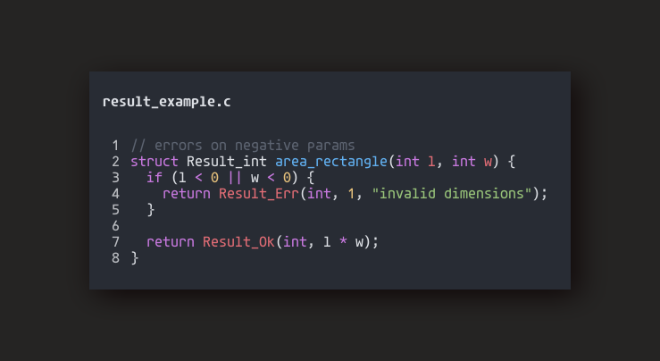
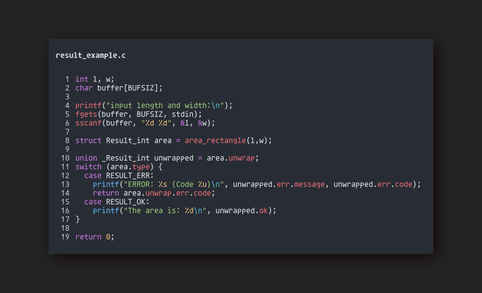
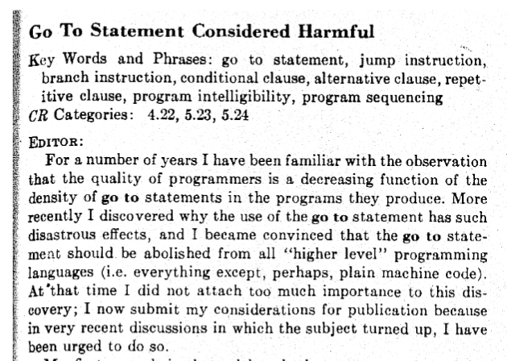
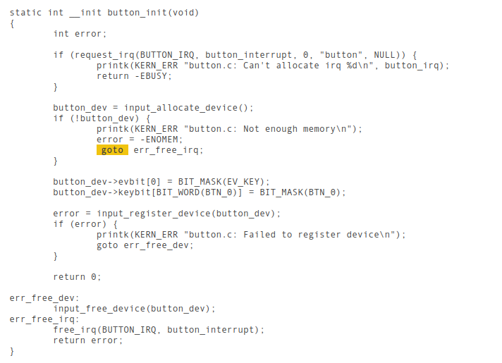

<!-- jump_to_middle -->
re: memory safety
==

<!-- end_slide -->

<!-- new_lines: 10 -->


<!-- end_slide -->

undefined behavior
==

<!-- font_size: 2 -->

<!-- incremental_lists: true -->
- A lot of C's performance can be attributed to <span style="color:red">*having*</span> undefined behavior.
- In line with the rest of the language's *design principles*.
- <span style="color:red">*Sacrifice*</span> safety checks for a <span style="color:green">*staggering*</span> increase in its efficiency and the 
  ability to get away with the *fastest implementation* for target architectures.
  - If the use case <span style="color:red">*demanded*</span> for C in the first place, specifically for <span style="color:red">*real-time*</span> software, you should <span style="color:red">*NOT*</span> be willing to take that performance hit.

<!-- end_slide -->

<!-- jump_to_middle -->


<!-- end_slide -->

wtf
==

<!-- font_size: 2  -->
<!-- incremental_lists: true -->
- `union` has never been *"widely* deprecated from use.
  - neither has `goto`!
- It feels like its coming from a place of <span style="color:red">*fundamental*</span> misunderstanding of the language

<!-- incremental_lists: false -->
<!-- new_line -->

<!-- pause -->
It feels like the thought process was:
> So we tried C, we didn't understand why certain features existed or they weren't necessary for our use case, so we've decided that everyone else *also* doesn't know how to use it and therefore it shouldn't exist for all other use cases.

<!-- end_slide -->

<!-- font_size: 1 -->

<!-- column_layout: [1,1] -->
<!-- column: 0 -->
```c
struct IntOrFloatOrBool {
  int n;   // 4 bytes
  float f; // 4 bytes
  bool b;  // 1 byte
};

// [ i i i i ] [ f f f f ] [ b _ _ _ ]
// stored in memory with 12 bytes!
```

<!-- column: 1 -->
```c
union IntOrFloatOrBool {
  int n;    // 4 bytes
  float f;  // 4 bytes
  bool b;   // 1 byte
}

// [ x x x x ]
// stored in memory with 4 bytes.
```

<!-- reset_layout -->

---

<!-- column_layout: [1,1] -->
<!-- pause -->
<!-- column: 0 -->

```c
struct Foo {
  int bar;      // 4 bytes
  double baz;   // 8 bytes
  bool qux;     // 1 byte
}

/* 
  [ i i i i | _ _ _ _ ] 
  [ d d d d | d d d d ] 
  [ b _ _ _ | _ _ _ _ ]

  stored in 24 bytes! 
  (16 if arranged such that double comes first)
*/
```

<!-- column: 1 -->
```c
union Foo {
  int bar;      // 4 bytes
  double baz;   // 8 bytes
  bool qux;     // 1 byte
}

/* 
  [ x x x x | x x x x ] 

  stored in 8 bytes!
*/
```

<!-- end_slide -->

tagged unions
==

Usually, we only deal with unions one type at a time. Let's call this type the
union's <span style="color:green">*active*</span> type.

```c
typedef union {
  int rotations;
  float degrees;
} Rotation;

Rotate angle = { .degrees = 0.45f };  // float as the active type
Rotate cycles = { .rotations = 0.4 }; // int
```

<!-- pause -->

```c
/**
 * Animate a rotation on an `object`.
 *
 * If `rotation` is a float, rotate by that angle in degrees.
 * If it is an integer, do that number of full rotations. (Negative for clockwise)
 */
void object_rotate(Object *obj, Rotate rotation);
```

# We don't have a way to know <span style="color:green">*what*</span> the active type is!

<!-- end_slide -->

```c
typedef enum {
  FULL,
  ANGLE
} RotateType;

/**
 * Animate a rotation on an `object`.
 *
 * If `rotate_type` is `ANGLE`, rotate by that angle in degrees.
 * If it is `FULL`, do that number of full rotations. (Negative for clockwise)
 */
void object_rotate(Object *obj, Rotate rotation, RotateType rotate_type);
```

<!-- pause -->

# But if you've tinkered around with C before, you should notice that this is a very familiar pattern.

<!-- pause -->

<!-- column_layout: [1,1] -->

<!-- column: 0 -->
```c
/**
 * Return the sum of n-length list.
 */
int sum(int nums[], unsigned int n);
```

<!-- incremental_lists: true -->
- `nums` <span style="color:red">*loses*</span> the size information when passed as an argument, which means that we have to pass in the size as a separate argument.
- But a workaround to this is <span style="color:green">*coupling*</span> the size information with the array, using a `struct`.

<!-- column: 1 -->

<!-- pause -->
```c
typedef struct {
  int* items;
  unsigned int size;
} IntArray;

/**
 * Return the sum of a list.
 */
int sum(IntArray nums);
```

- The size is encoded into the struct.

<!-- end_slide -->

tagged union
==

```c
enum RotateType {
  FULL,
  ANGLE,
};

union _Rotate {
  int rotations;
  float angle;
};

typedef struct {
  enum RotateType type;
  union _Rotate unwrap;
} Rotate;
```

<!-- pause -->

# However, using this type is not ergonomic at all, to say the least.

<!-- pause -->

```c
// A Rotate ANGLE variant with value 90.0 degrees
Rotate right_angle = { .type = ANGLE, .unwrap = (union _Rotate) { .angle = 90.0f }};
// A Rotate FULL variant with value 2 rotations
Rotate doubleturn = { .type = FULL, .unwrap = (union _Rotate) { .rotations = 2 }};
```

<!-- end_slide -->

wizardry
==

# Answer: function macros

<!-- incremental_lists: true -->
- Macros should never be your first solution when it comes to problems you encounter in your code.
- You should only ever consider it when you need actual <span style="color:green">*code*</span> to be written for convenience sake.
- That being said, this is a perfect usecase for them.

```c
// A Rotate ANGLE variant with value 90.0 degrees
Rotate right_angle = { .type = ANGLE, .unwrap = (union _Rotate) { .angle = 90.0f }};
// A Rotate FULL variant with value 2 rotations
Rotate doubleturn = { .type = FULL, .unwrap = (union _Rotate) { .rotations = 2 }};
```

- One way we could tackle this ergonomic issue is by storing the variant type *out-of-band*.
  - Instead of declaring it as a value, we *encode* that idea in the macro's name itself.

```c
#define Rotate_FULL(_degrees) \
  ((Rotate) { .type = FULL, .unwrap = (union _Rotate) { .rotations = (_degrees) }})

#define Rotate_ANGLE(_angle) ((Rotate) { \
  .type = ANGLE,                         \
  .unwrap = (union _Rotate) {            \
    .angle = (_angle)                    \
  }                                      \
})
```

<!-- end_slide -->
<!-- new_line -->

So now all we have to do to create instances of these unions are:

<!-- pause -->
```c
Rotate right_angle = Rotate_ANGLE(90.0f);
Rotate doubleturn = Rotate_FULL(2);
```

<!-- pause -->
Or a much more explicit alternative, is to make your macro take in the variant and an anonymous union that corresponds to the type specified by the variant.

```c
#define Rotate(_variant, _union) \
  ((Rotate) { .type = _variant, .unwrap = (union _Rotate) _union })

Rotate halfturn = Rotate(ANGLE, { .rotations = 180.0f });
```

This version is more applicable if your tagged union has more variants than macros you are willing to write, at the cost of being more verbose in creating instances. *(Do note that there is no compatibility checking done with the value and the variant!)*

<!-- pause -->

# Here's how you would access the fields.

<!-- column_layout: [5,3] -->
<!-- column: 0 -->
```c
union _Rotate unwrapped = doubleturn.unwrap;
switch (doubleturn.type) {
  case FULL:
    printf("Rotate 360deg %d times.", unwrapped.rotations);
    break;
  case ANGLE:
    printf("Rotate %.2fdeg.", unwrapped.unwrap.angle);
}
```

<!-- column: 1 -->
```c
Rotate rotations[] = {
  Rotate_FULL(4),
  Rotate_ANGLE(45.0f),
  Rotate_FULL(0)
};
```

<!-- end_slide -->

tagged unions
==

<!-- incremental_lists: true -->
- Can be seen in various modern languages such as *Rust* (wherein they are simply called as `Enum`) and *Zig*.
  - Because of first class language support, they can implement better abstractions ontop of it, especially pattern matching

# Applications
 - the `Result<T,E>` type, which in of itself enables the concept of passing
   "errors as values," which is behavior that is way easier to deal with
   than throwing exceptions from anywhere
 - the `Option<T>` type, which allows encapsulation of null values.
   - Interestingly enough, we don't actually need a union for this type, but the pattern of having a tag dictate the active type makes it still fall into this category.
 - Lexical tokens `Token`, for writing leaner parsers that allow for compile-time type checks on your `Token` variants.
 - ...and other use cases that require <span style="color:green">*alternation*</span> over types. Think of tagged unions as being able to <span style="color:green">"boolean OR"</span> together types, while structs let you <span style="color:green">"boolean and"</span> them.

<!-- end_slide -->

<!-- column_layout: [1,1] -->

<!-- column: 0 -->


<!-- column: 1 -->



<!-- end_slide -->

`goto`
==

<!-- column_layout: [1,1] -->

<!-- column: 0 -->


<!-- alignment: center -->
*Edsger Dijkstra*

<!-- column: 1 -->

<!-- new_lines: 1 -->


<!-- end_slide -->

think for yourself!
==


<!-- end_slide -->

linux kernel
==

# Creating an input device driver
- https://www.kernel.org/doc/html/v4.17/input/input-programming.html



<!-- end_slide -->

<!-- jump_to_middle -->
thank you for tuning in
==
